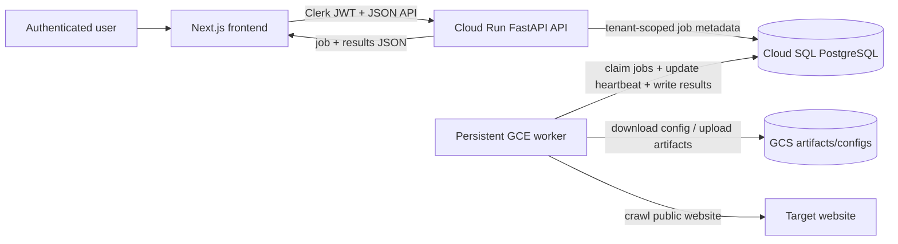

# Cloud Crawl Architecture And Workflow

## Purpose

This document captures the cloud crawl architecture that is currently implemented and verified in `frog-in-the-cloud`, with a focus on the path that is working today:

- authenticated crawl creation from the web UI
- cloud execution on a persistent licensed GCE worker
- job status and heartbeat updates in PostgreSQL
- crawl extraction into relational tables
- frontend monitoring and result viewing

It also explains how data enters the system, how it moves between services, and what leaves the system.

## What Is Working Today

The following flow has been verified end to end:

1. A user can create a new crawl from the staging-backed frontend.
2. The API writes a tenant-scoped `crawl_jobs` row and queues work for the GCE path.
3. A persistent GCE worker claims the queued job and runs Screaming Frog in the cloud.
4. The worker updates job heartbeat timestamps while the crawl is active.
5. The crawl is extracted into PostgreSQL tables for pages, issues, and links.
6. The frontend can monitor live status and heartbeat activity and then display completed results.

Verified reference flow:

- Target URL: `https://www.fox.com/`
- Profile: `FOX One`
- Verified crawl result: completed successfully with `85` URLs crawled

## Verified Runtime Path

This repo supports multiple executor modes in code, but the path below is the one that has been verified and should be treated as the current reference architecture:

- Control plane: FastAPI API on Cloud Run
- Database: PostgreSQL on Cloud SQL
- Worker mode: `gce`
- Dispatch mode: `persistent`
- Crawl engine: Screaming Frog SEO Spider CLI on a licensed GCE VM
- Frontend: Next.js app calling the API with Clerk auth

Other code paths such as `local`, `none`, and GCE `ephemeral` exist, but this document focuses on the persistent GCE worker path because that is the production-intent flow that has been debugged and confirmed working.

## System Components

| Component | Role | Key files |
| --- | --- | --- |
| Next.js frontend | Creates crawls, polls status, renders results | `web/app/(dashboard)/crawls/new/page.tsx`, `web/app/(dashboard)/crawls/[id]/page.tsx`, `web/components/crawl-progress.tsx`, `web/lib/api-client.ts` |
| FastAPI API | Validates requests, creates jobs, exposes result APIs | `api/app/routers/crawls.py`, `api/app/routers/results.py`, `api/app/main.py` |
| Auth + tenancy | Scopes all crawl reads and writes to the active org | `api/app/auth.py`, `api/app/models.py` |
| Job persistence | Stores jobs, pages, issues, links, and heartbeat timestamps | `api/app/models.py` |
| Executor orchestration | Chooses `local`, `none`, or `gce` execution | `api/crawler/executor.py`, `api/app/config.py` |
| GCE launcher path | Creates worker VMs when using the GCE launch path | `api/crawler/cloud_tasks.py`, `api/app/routers/internal.py`, `api/crawler/launcher.py` |
| Persistent worker | Claims queued jobs and runs the crawl loop | `api/crawler/worker.py` |
| Crawl extractor | Loads Screaming Frog artifacts into PostgreSQL | `api/crawler/extractor.py` |
| Infra provisioning | Creates Cloud Run, Cloud SQL, GCS, Tasks, VPC, and GCE template | `infra/main.tf`, `infra/modules/*`, `infra/packer/worker.pkr.hcl` |

## High-Level Architecture



## End-To-End Workflow

### 1. Crawl creation

1. The user opens the crawl form in the frontend.
2. The frontend submits `target_url` and `profile_id` to `POST /api/crawls`.
3. Clerk auth is attached as a bearer token.
4. The API resolves the active tenant and validates that the selected profile belongs to that tenant.
5. The API inserts a new `crawl_jobs` row with:
   - `status = queued`
   - `executor = gce`
   - target URL
   - profile reference
   - tenant reference

### 2. Dispatch to the worker layer

For the verified persistent path:

1. The job remains in the database as `queued`.
2. The long-running GCE worker polls for the next available queued job.
3. The worker claims the job using database locking semantics to avoid double-processing.
4. The worker transitions the job to `running`.

### 3. Crawl execution on GCE

1. The worker loads the crawl profile configuration.
2. If needed, config or artifacts are read from GCS.
3. The worker launches Screaming Frog CLI on the VM.
4. While Screaming Frog is running, the worker updates `last_heartbeat_at` on the job so the UI can detect that the worker is still alive.
5. Screaming Frog crawls the public target site from the VM.

### 4. Extraction and persistence

1. When the crawl completes, the worker transitions the job through extraction/loading phases.
2. The extractor reads the Screaming Frog output artifact.
3. The extractor writes normalized data into:
   - `crawl_pages`
   - `crawl_issues` (both Screaming Frog issue reports and derived `status_<code>` issue types)
   - `crawl_links`
4. The job is marked `complete`.
5. `urls_crawled` and other job fields are updated in PostgreSQL.
6. When configured, crawl artifacts are uploaded to GCS for retention and replay.

### 5. Frontend monitoring and result display

1. After a crawl is created, the frontend navigates to `/crawls/{job_id}`.
2. The detail page polls `GET /api/crawls/{job_id}` while the job is active.
3. The UI shows:
   - status
   - approximate progress
   - last worker heartbeat
   - stale-worker warning if heartbeats stop
4. Once the job reaches `loading` or `complete`, the frontend begins loading results.
5. The frontend renders pages, issues, and links from the results endpoints.

## Status Lifecycle

The current crawl lifecycle is:

```text
queued -> provisioning -> running -> extracting -> loading -> complete
```

Not every job uses every intermediate state. For the verified persistent worker path, the normal progression is:

```text
queued -> running -> extracting -> loading -> complete
```

Failure or operator interruption can instead move a job to:

- `failed`
- `cancelled`

## Data Flow In And Out

### Data entering the system

The system has three main inputs:

1. User input from the frontend
   - `target_url`
   - `profile_id`
   - authenticated org context from Clerk
2. Crawl configuration data
   - profile metadata from PostgreSQL
   - Screaming Frog config files from local worker storage or GCS
3. Public website content
   - HTML, redirects, metadata, links, and crawl responses fetched by Screaming Frog from the target site

### Data moving inside the system

Internal data movement looks like this:

1. The API writes a `crawl_jobs` row to PostgreSQL.
2. The worker reads queued jobs from PostgreSQL.
3. The worker writes heartbeat timestamps and status transitions back to PostgreSQL.
4. The worker reads crawl config and may write artifacts to GCS.
5. The extractor writes structured crawl data into relational tables.

### Data leaving the system

The system produces four main outputs:

1. Job metadata back to the frontend
   - status
   - heartbeat
   - error state
   - URL counts
2. Crawl result records back to the frontend
   - pages
   - issues
   - links
3. Optional exported artifacts in GCS
   - raw crawl outputs
   - reusable artifacts for debugging or replay
4. CSV exports from the API for downstream analysis

## Authentication And Tenant Boundaries

All user-facing crawl APIs are tenant scoped.

This means:

- the frontend sends a Clerk token
- the API resolves the active tenant from that token
- crawl profiles and crawl jobs are filtered by tenant
- a job created for one org does not appear in another org's crawl list or detail routes

This is an important part of the architecture because several debugging steps earlier in the rollout were caused by valid jobs existing in staging under the wrong tenant.

## Infrastructure Relationships

The deployed cloud pieces connect like this:

1. Cloud Run hosts the FastAPI control plane.
2. Cloud Run talks to Cloud SQL over the configured private connection.
3. GCE workers also talk to Cloud SQL, using a local Cloud SQL proxy/socket setup on the VM.
4. GCS stores artifacts and can also store worker-consumable crawl profile configs.
5. Terraform provisions the shared infrastructure.
6. Packer builds the worker image used by the GCE template.

## Frontend Monitoring Notes

The monitoring UX now supports the full verified path:

- crawl list page can render tenant crawl rows correctly
- new crawl submission redirects to the real `job_id`
- retry and duplicate also redirect to the real `job_id`
- crawl detail page shows live heartbeat updates while active
- completed jobs render page rows correctly

The key frontend files are:

- `web/lib/api-client.ts`
- `web/lib/api-types.ts`
- `web/app/(dashboard)/crawls/new/page.tsx`
- `web/app/(dashboard)/crawls/[id]/page.tsx`
- `web/components/crawl-progress.tsx`

## What Was Achieved During This Debug Cycle

This debug cycle established the following concrete outcomes:

1. The persistent licensed GCE worker path is functional.
2. Heartbeats are visible in the frontend while a job is running.
3. The crawl list page can show real tenant jobs from staging.
4. The new-crawl redirect path now lands on a real crawl detail page instead of an undefined route.
5. A full `https://www.fox.com/` crawl can be launched, monitored, and viewed in the UI end to end.

## Current Operational Notes

- The staging-backed frontend has been run locally on `http://localhost:3002`.
- The backend API path used for live verification was the staging Cloud Run service.
- Repository-wide frontend lint output is currently noisy because generated Next.js output is being scanned, but the crawl-flow edits themselves type-check and the verified runtime behavior is correct.

## Cross-Crawl Comparison Summaries

The system now supports crawl-to-crawl comparison for completed jobs.

### How the baseline is selected

For any completed crawl, the API finds the immediately previous crawl in the same logical series:

- same `tenant_id`
- same `profile_id`
- same `target_url`
- status `complete`
- `created_at` strictly before the current job

The most recent matching job is used as the baseline. If no previous crawl exists, the summary is returned without comparison data.

### What the summary includes

The `GET /api/crawls/{job_id}/summary` endpoint returns:

- **Current and previous aggregates**: URLs crawled, average response time, total issue count
- **Status-code distribution**: counts for 2xx, 3xx, 4xx, 5xx buckets in both crawls
- **Exact status-code breakdown**: per-code page counts, including a bucket for URLs with no recorded status code
- **Indexability distribution**: indexable vs non-indexable page counts
- **Issue-type deltas**: newly introduced issue types, resolved issue types, and per-type count changes

### What the summary does not include (v1)

- Arbitrary user-selected baselines
- Multi-crawl trend lines or dashboards
- Per-page field diffs across crawls
- URL canonicalization beyond raw stored `address` matching

### Frontend rendering

The comparison summary appears on the crawl detail page between the stat cards and the issue/pages/links tabs. It renders:

- a link to the previous crawl for context
- delta stat cards for key metrics
- a status-code distribution delta grid
- badge groups for new/resolved issue types
- a row-by-row issue-type count change table

The summary loads independently via `useQuery` and degrades silently if unavailable.

### Key files

- Backend service: `api/app/services/crawl_summary.py`
- Response schemas: `api/app/schemas.py` (`CrawlComparisonSummary`, `CrawlSnapshotAggregates`, etc.)
- API endpoint: `api/app/routers/results.py` (`GET /{job_id}/summary`)
- Frontend component: `web/components/crawl-change-summary.tsx`
- Frontend types: `web/lib/api-types.ts` (`CrawlComparisonSummary` and related interfaces)

### Expanded page detail drawer

The page detail drawer now shows all stored SEO fields, organized into four groups:

- **Crawl metrics**: status code, depth, word count, response time, size, link score
- **SEO on-page**: title, meta description, H1, indexability, canonical, canonical link element
- **Technical**: content type, HTTP version, redirect URL, meta robots, X-Robots-Tag, pagination status
- **Link graph**: inlinks, outlinks

The pages table also supports filtering by content type in addition to the existing status code and indexability filters.

## Recommended Next Documentation

This document explains the current verified architecture and data flow.

If needed, the next useful companion docs would be:

1. a deployment runbook for restarting the staging-backed frontend and API verification flow
2. a worker operations runbook for license, image, and VM troubleshooting
3. an incident/debug playbook for stuck jobs, stale heartbeats, or empty frontend lists
